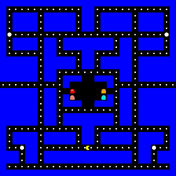
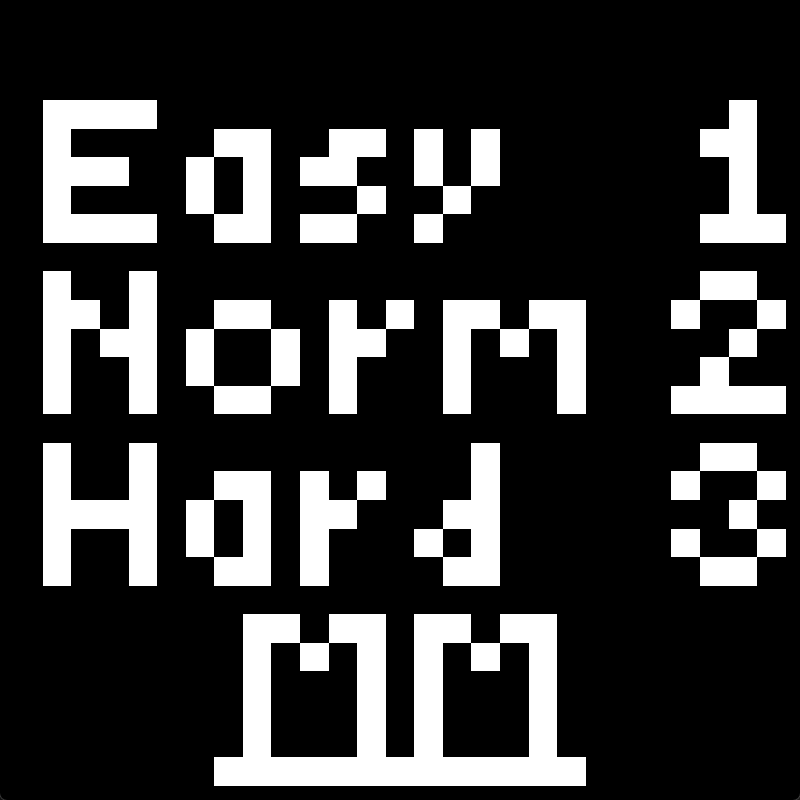
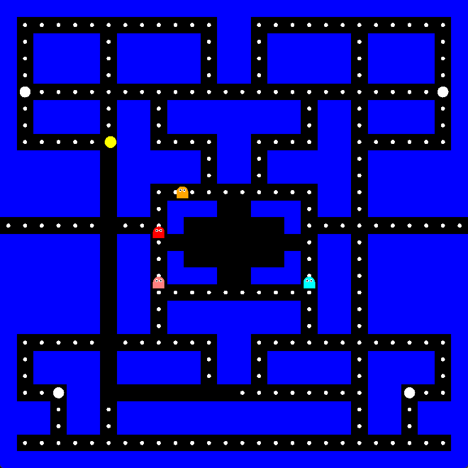
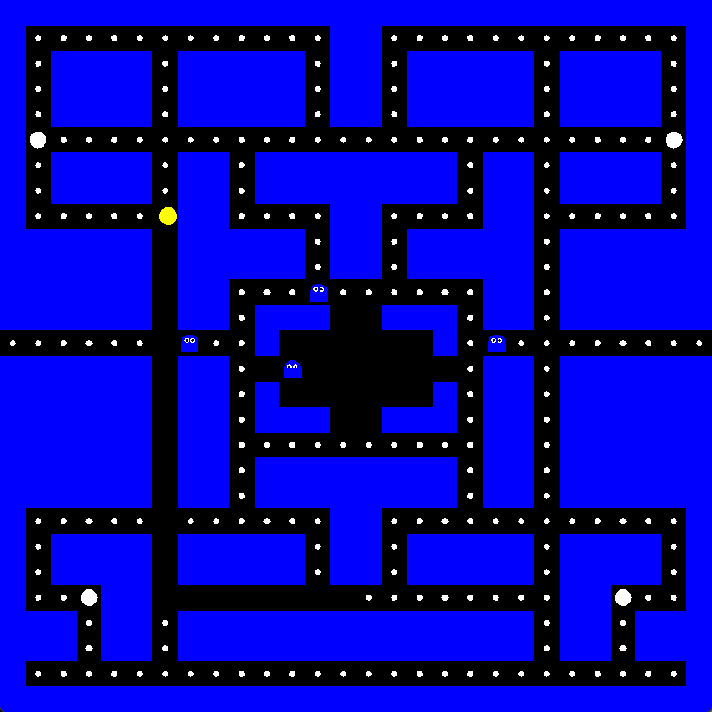
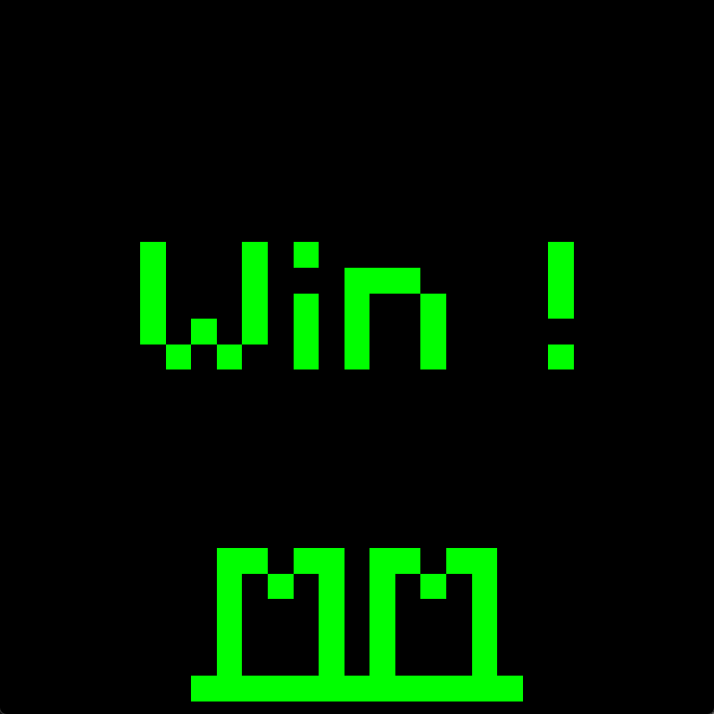
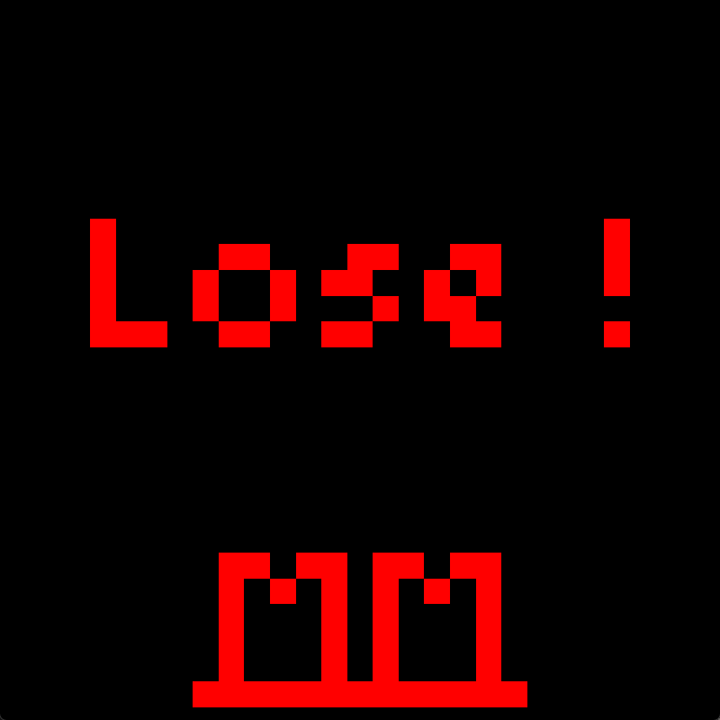

# Pac-Man

A Pac-Man clone written from scratch in Python with PyOpenGL and GLFW.

<p align="center">
  
</p>

| Difficulty screen | Gameplay | Power mode |
| :---: | :---: | :---: |
|  |  |  |

| Win screen | Lose screen |
| :---: | :---: |
|  |  |

[](LICENSE)

## Overview

This is my project for the Computer Graphics course at Shiraz University
(Spring 2024). The goal was to build a complete, playable game using only
low-level OpenGL primitives, so everything on screen, including the text of
the menu and the win/lose screens, is drawn from quads and triangle fans.
The game logic is separated from the rendering and runs at the same speed on
any monitor thanks to delta-time movement.

## Features

- Three difficulty levels that change how fast the ghosts move
- Four ghosts driven by a greedy chase algorithm that turns into a flee
  algorithm while Pac-Man is powered up
- Power pellets: for five seconds the ghosts turn blue and can be eaten,
  sending them back to the ghost house
- A teleport tunnel connecting the left and right edges of the maze
- Wall collision for Pac-Man and the ghosts, with a cornering assist so turns
  do not need pixel-perfect timing
- Win and lose screens, score in the window title, automatic restart

## How it works

**Rendering.** The window is a 2D orthographic view of clip space (-1 to 1 on
both axes) drawn with immediate-mode OpenGL. Walls are `GL_QUADS`, pellets and
ghost bodies are `GL_TRIANGLE_FAN` circles, and Pac-Man is a fan with a wedge
left out for the mouth, which opens and closes on a timer. The menu and the
win/lose messages are 28x28 pixel-art grids rendered as squares.

**The grid.** The maze is a 28x28 array of walls and a matching array of
pellets (`1`) and power pellets (`2`). Movement is continuous, but collision is
resolved against the grid: a move is legal if the four corners of the mover's
bounding square all land on open cells. Row 13 is open at both ends and its
columns wrap around, which is what makes the tunnel work.

**Ghost AI.** Ghosts travel along corridor centre lines and decide only when
they pass the centre of a cell. Each decision is greedy: of the open
neighbouring cells, take the one whose centre is closest to Pac-Man in
straight-line distance, or farthest while frightened. A ghost never reverses
unless it hits a dead end, so it commits to a corridor instead of oscillating,
and a cell already holding another ghost counts as blocked, which keeps the
four ghosts spread out.

**State machine.** A first window shows the difficulty menu and waits for
`1`, `2` or `3`. The game window then runs one loop per frame: compute the
delta time, update Pac-Man, eat pellets, expire the power timer, move the
ghosts, and test Pac-Man against the ghosts. The state is `playing`, `won`
(all pellets eaten) or `lost` (touched by a ghost); the last two show a screen
for three seconds and restart the round on the same difficulty.

## Controls

| Key | Action |
| --- | --- |
| `1` / `2` / `3` | Choose Easy / Normal / Hard on the menu |
| Arrow keys | Move Pac-Man. He keeps moving until he hits a wall; press early to queue a turn |
| Close window | Quit |

## Getting started

Prerequisites: Python 3.9 or newer and a GPU driver with OpenGL support
(any desktop machine from the last fifteen years qualifies).

```bash
git clone https://github.com/matinmonshizadeh/pac-man.git
cd pac-man
python -m venv .venv
.venv\Scripts\activate        # Windows; on macOS/Linux: source .venv/bin/activate
pip install -r requirements.txt
python main.py
```

## Project structure

```
pac-man/
├── main.py              # Launcher: python main.py
├── src/pacman/
│   ├── config.py        # Constants, maze and pellet grids, colours, pixel-art screens
│   ├── entities.py      # Pac-Man and Ghost movement, wall collision, ghost AI
│   ├── game.py          # State machine, scoring, power mode, ghost collisions
│   ├── rendering.py     # Immediate-mode OpenGL drawing
│   └── main.py          # GLFW windows, key mapping, frame loop
├── docs/                # Screenshots and demo GIF
├── requirements.txt
└── LICENSE
```

## Limitations and future work

- Rendering uses the legacy fixed-function pipeline (`glBegin`/`glEnd`).
  A modern port would upload the maze once as a vertex buffer and draw it
  with shaders.
- The ghost AI is greedy, not a path search, so a ghost can circle a block
  when a wall lies between it and Pac-Man. Breadth-first search on the grid
  would give the classic "always finds you" behaviour.
- No sound, no lives, and no high-score table: one round ends the game.

## License

MIT, see [LICENSE](LICENSE).
